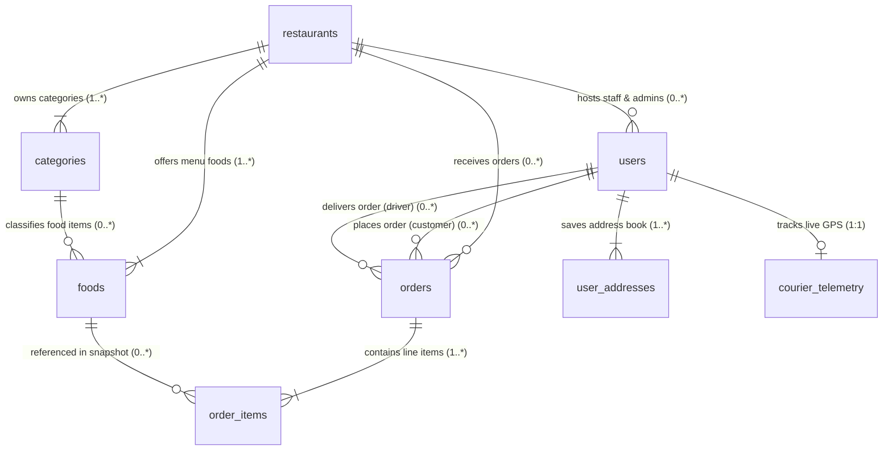

# 🍔 Restaurant Online Ordering & Multi-Tenant Delivery System

A production-ready architecture and implementation for online menu ordering, kitchen management, multi-tenant restaurant catalog, shared delivery dispatch, live tracking, and cash settlement.

---

## ⚡ Quick Start

From the project root directory:

1. **Install dependencies once**:

   ```bash
   npm install
   cd frontend && npm install && cd ..
   ```

2. **Run both Backend (PHP) & Frontend (Next.js) together**:
   ```bash
   npm run dev
   ```

This launches:

- **Backend API**: `http://localhost:8000` (PHP Server)
- **Frontend App**: `http://localhost:3000` (Next.js App)
- **Telegram Bot Listener**: Local Long-Polling Service (`backend/telegram-poll.php`)

---

## 🗄️ Database Setup & Reset Data

### 1. Initial Database Setup & Migration
Creates all database tables and seeds initial data:
```bash
npm run setup:db
# or
php backend/database/setup.php
```

### 2. Reset & Re-Seed Database (Fresh Clean Data)
To completely wipe all existing tables and re-seed sample multi-tenant restaurants, categories, dishes, users, and couriers from scratch:
```bash
npm run db:reset
# or
php backend/database/setup.php --fresh
```

### 3. Reset via Browser (Web Interface)
While the PHP backend server is running (`http://localhost:8000`), open in browser:
- **Initial Setup**: `http://localhost:8000/database/setup.php`
- **Fresh Reset & Re-Seed**: `http://localhost:8000/database/setup.php?fresh=1`

---

## 🗄️ Database Architecture & Entity Relationship Diagram (ERD)

> [!NOTE]
> The database is built on a **Multi-Tenant MySQL Architecture (InnoDB)** with strict FK constraints, cascaded cleanups, and historical line-item snapshot protection.
> Visual Draw.io diagram file: 🎨 [`DATABASE_RELATIONSHIPS.drawio`](file:///d:/learning/Sarana/Online-Ordering/DATABASE_RELATIONSHIPS.drawio) | Comprehensive specification: [`DATABASE_RELATIONSHIPS.md`](file:///d:/learning/Sarana/Online-Ordering/DATABASE_RELATIONSHIPS.md)

### 🎨 Visual Entity Relationship Diagram (Mermaid / Draw.io Model)



### 📊 Database Entities Summary (11 Core Tables)

| Table Name | Primary Key | Foreign Keys | Role / Purpose | Migration Tier |
| :--- | :--- | :--- | :--- | :--- |
| `restaurants` | `id` | None | Multi-tenant restaurant entity profiles & store settings | Tier 1 (Root Parent) |
| `users` | `id` | `restaurant_id` | Accounts for Super Admin, Admin, Staff, Courier & Customer | Tier 2 (Parent / Child) |
| `categories` | `id` | `restaurant_id` | Menu categories per restaurant tenant | Tier 2 (Child of Restaurants) |
| `foods` | `id` | `restaurant_id`, `category_id` | Food catalog items, pricing, badges & prep time | Tier 3 (Child of Categories & Restaurants) |
| `orders` | `id` | `restaurant_id`, `user_id`, `delivery_staff_id` | Customer purchase orders, KHQR payment & status state machine | Tier 3 (Child of Restaurants & Users) |
| `order_items` | `id` | `order_id`, `food_id` | Historical item snapshot & pricing inside orders | Tier 4 (Child of Orders & Foods) |
| `user_addresses` | `id` | `user_id` | Saved delivery locations per customer | Tier 3 (Child of Users) |
| `courier_telemetry` | `id` | `user_id` (UNIQUE) | Live GPS tracking, speed, temp & vehicle status for couriers | Tier 3 (Child of Users - 1:1) |
| `settings` | `id` | `restaurant_id` (Logical) | Key-value system & KHQR payment credentials | Independent / Tenant Config |
| `system_logs` | `id` | `user_id` (Logical) | Audit log & security incident trail | Independent / Audit |
| `rate_limits` | `id` | None | Anti-spam & brute-force IP rate limiting | Independent / Security |

### 🔗 Foreign Key & Relationship Mapping Table

| Source Table (Child) | FK Field | Target Table (Parent) | PK Field | Relationship | Cardinality | On Delete Action | Business Logic & Description |
| :--- | :--- | :--- | :--- | :--- | :--- | :--- | :--- |
| `users` | `restaurant_id` | `restaurants` | `id` | Many-to-One | `0..* : 0..1` | `SET NULL` | Associates admins & staff with their restaurant. NULL for Super Admins & Customers. |
| `categories` | `restaurant_id` | `restaurants` | `id` | Many-to-One | `1..* : 1` | `CASCADE` | Groups categories under a specific restaurant tenant. Deleting tenant wipes categories. |
| `foods` | `restaurant_id` | `restaurants` | `id` | Many-to-One | `1..* : 1` | `CASCADE` | Multi-tenant isolation for food items. |
| `foods` | `category_id` | `categories` | `id` | Many-to-One | `0..* : 0..1` | `SET NULL` | Categorizes food items. Unassigned items set to NULL if category deleted. |
| `orders` | `restaurant_id` | `restaurants` | `id` | Many-to-One | `0..* : 0..1` | `SET NULL` | Links order to target restaurant tenant. Retains history if restaurant deleted. |
| `orders` | `user_id` | `users` | `id` | Many-to-One | `0..* : 0..1` | `SET NULL` | Links order to registered customer account. NULL for guest checkout. |
| `orders` | `delivery_staff_id` | `users` | `id` | Many-to-One | `0..* : 0..1` | `SET NULL` | Assigns courier/driver (`role='delivery'`) to deliver the order. |
| `order_items` | `order_id` | `orders` | `id` | Many-to-One | `1..* : 1` | `CASCADE` | Line items composing an order. Wiped when parent order is deleted. |
| `order_items` | `food_id` | `foods` | `id` | Many-to-One | `0..* : 0..1` | `SET NULL` | References catalog food. Keeps historical item snapshots (`food_name`, `price`) intact. |
| `user_addresses` | `user_id` | `users` | `id` | Many-to-One | `1..* : 1` | `CASCADE` | Saved customer delivery locations. Wiped when customer account is deleted. |
| `courier_telemetry` | `user_id` | `users` | `id` | One-to-One | `0..1 : 1` | `CASCADE` | Live GPS location, speed, temperature & vehicle data per active driver. |

### ⚡ Database Migration Dependency Tier Order

Tables must be created and seeded in strict hierarchical order to satisfy Foreign Key dependencies:

```txt
1. restaurants           (Root Parent Entity)
├── 2. users             (Parent of Addresses, Telemetry, Orders; Child of Restaurants)
│   ├── 7. user_addresses
│   └── 8. courier_telemetry (1:1 Driver GPS)
├── 3. categories        (Child of Restaurants)
│   └── 4. foods         (Child of Restaurants & Categories)
└── 5. orders            (Child of Restaurants & Users)
    └── 6. order_items   (Child of Orders & Foods - Line Items Snapshot)

Independent Tables:
- 9. system_logs         (Audit Trail)
- 10. rate_limits        (IP Security)
- 11. settings           (Global & Tenant Config)
```

---

## 🔐 Default Demo Accounts & Login Credentials

| Role | Email | Phone | Password | Access Route & Scope |
| :--- | :--- | :--- | :--- | :--- |
| 🛡️ **Super Platform Admin** | `superadmin@system.com` | `012000000` | `admin123` | Full Multi-Tenant Platform Admin (`/admin`) |
| 🏪 **Tenant Admin (Amber Bistro)** | `admin@restaurant.com` | `012111222` | `admin123` | Amber Bistro Kitchen & Orders (`/admin`) |
| 🏪 **Tenant Admin (Spice Route)** | `admin2@restaurant.com` | `012222333` | `admin123` | Spice Route Kitchen & Orders (`/admin`) |
| 🛵 **Delivery Courier #1** | `delivery1@restaurant.com` | `098333444` | `driver123` | Shared Fleet Dispatch & GPS Telemetry (`/delivery`) |
| 🛵 **Delivery Courier #2** | `delivery2@restaurant.com` | `099555666` | `driver123` | Shared Fleet Dispatch & GPS Telemetry (`/delivery`) |
| 👤 **Customer (VIP)** | `david.chen@example.com` | `+1 (555) 234-9912` | `customer123` | Customer Online Ordering & Tracking (`/login`) |

---

## 🏗️ Production Build & Run

To build and run the optimized production bundle for both Frontend and Backend:

```bash
npm run prod
# or
npm start
```

This performs:
1. Compiles and optimizes Next.js frontend assets (`npm run build:frontend`).
2. Launches both the **PHP Backend Server** and **Next.js Production Node Server**.

---

## 🛠️ CLI Commands Cheat Sheet

| Action | Command |
| :--- | :--- |
| **Run Fullstack Dev Servers** | `npm run dev` |
| **Run Fullstack Production (Build & Start)** | `npm run prod` _(or `npm start`)_ |
| **Build Frontend Only** | `npm run build:frontend` |
| **Setup & Seed Database** | `npm run setup:db` |
| **Reset & Re-Seed Database** | `npm run db:reset` |
| **Backend API Only** | `npm run backend` |
| **Frontend App Only** | `npm run frontend` |
| **Telegram Bot Polling** | `npm run telegram:poll` |
