# 🔄 System Flow Architecture & User Journey Guide

**System:** Online Ordering System (Multi-Tenant Real-Time Platform)  
**Roles Supported:** Customer, Restaurant Admin / Kitchen Staff, Delivery Driver, Super Admin  
**Draw.io Diagram File:** 🎨 [`SYSTEM_FLOW_ARCHITECTURE.drawio`](file:///d:/learning/Sarana/Online-Ordering/SYSTEM_FLOW_ARCHITECTURE.drawio)  
**Last Updated:** September 18, 2026  

---

## 🗺️ 1. Master System Flow Diagram (Mermaid)

```mermaid
flowchart TD
    %% Node Styling
    classDef customer fill:#DBEAFE,stroke:#2563EB,stroke-width:2px,color:#1E3A8A;
    classDef kitchen fill:#FFEDD5,stroke:#EA580C,stroke-width:2px,color:#7C2D12;
    classDef delivery fill:#DCFCE7,stroke:#16A34A,stroke-width:2px,color:#14532D;
    classDef backend fill:#F3E8FF,stroke:#9333EA,stroke-width:2px,color:#581C87;
    classDef decision fill:#FEF08A,stroke:#CA8A04,stroke-width:2px,color:#713F12;
    classDef success fill:#BBF7D0,stroke:#16A34A,stroke-width:2px,color:#14532D;

    %% 1. Customer Entry & Browse
    Start([👤 Customer Enters Website]):::customer --> Browse[Browse Categories & Select Food Items]:::customer
    Browse --> Cart[Click Add to Cart / Checkout]:::customer
    
    %% Auth Decision
    Cart --> AuthCheck{Is Customer Logged In?}:::decision
    AuthCheck -- ❌ No --> LoginModal[Show Quick Login / Registration Modal]:::backend
    LoginModal --> AuthAPI[POST /api/auth/login.php]:::backend
    AuthAPI --> AuthCheck
    AuthCheck -- ✅ Yes --> Fulfillment{Select Fulfillment Option}:::decision

    %% Fulfillment Branches
    Fulfillment -- 🛍️ Pickup --> PickupDetails[Select Pickup Time Slot<br/>Delivery Fee: $0.00]:::customer
    Fulfillment -- 🚚 Delivery --> DeliveryDetails[Select Address / Pin Map<br/>Calculate Delivery Fee]:::customer

    PickupDetails --> Payment[Select Payment Method: KHQR / Cash]:::customer
    DeliveryDetails --> Payment

    %% Order Submission & Backend Processing
    Payment --> SubmitOrder[POST /api/orders.php<br/>DB: Save 'orders' & 'order_items']:::backend
    SubmitOrder --> BroadcastNew[Broadcast 'new-order' Real-time Event]:::backend
    SubmitOrder --> CustomerTrack[Customer Screen: Live Progress Bar]:::customer

    %% 2. Kitchen & Restaurant Processing
    BroadcastNew --> KitchenAlert[Kitchen Dashboard: Loud Sound Chime & Visual Alert]:::kitchen
    KitchenAlert --> KitchenDecision{Kitchen Action}:::decision
    KitchenDecision -- ❌ Reject --> CancelOrder[Update status: 'cancelled'<br/>Notify Customer]:::kitchen
    KitchenDecision -- ✅ Accept --> AcceptOrder[PATCH /api/order-status.php<br/>Status: 'accepted']:::kitchen

    AcceptOrder --> Cooking[Status: 'preparing'<br/>Chef Cooks Food]:::kitchen
    Cooking --> FoodReady{Fulfillment Type?}:::decision

    %% Kitchen Ready Destinations
    FoodReady -- 🛍️ Pickup --> ReadyPickup[Status: 'ready_for_pickup'<br/>Notify Customer to Collect]:::kitchen
    ReadyPickup --> CustomerCollect[Customer Arrives at Counter & Pays Cash]:::customer
    CustomerCollect --> KitchenComplete[Counter Staff Marks 'completed']:::kitchen

    FoodReady -- 🚚 Delivery --> ReadyDelivery[Status: 'ready_for_delivery'<br/>Broadcast 'delivery-dispatch']:::kitchen

    %% 3. Delivery Staff & GPS Telemetry Flow
    ReadyDelivery --> DriverAlert[Delivery Driver Dashboard Receives Job Alert]:::delivery
    DriverAlert --> DriverAccept[Driver Taps Accept & Pickup<br/>Assign orders.delivery_staff_id]:::delivery
    DriverAccept --> DriverStart[Driver Taps Start Delivery<br/>Status: 'on_the_way']:::delivery

    DriverStart --> GPSTelemetry[Background GPS Updates courier_telemetry<br/>Stream Live Coordinates to Customer Map]:::delivery
    GPSTelemetry --> ArriveCustomer[Driver Arrives at Customer Address]:::delivery
    ArriveCustomer --> CollectCOD[Hand Over Food Package & Collect Cash COD]:::delivery
    CollectCOD --> ConfirmDelivered[Driver Taps Confirm Delivered<br/>Status: 'delivered', payment_status: 'paid']:::delivery

    ConfirmDelivered --> OrderEnd([🎉 Order Completed!]):::success
    KitchenComplete --> OrderEnd
```



---

## 👥 2. Detailed Role-by-Role User Flow Architecture

### 1. 👤 CUSTOMER USER FLOW

```txt
[ Enter Website / App ]
          │
          ▼
[ Browse Restaurants & Food Catalog ]
  - Filter by Category (Drinks, Burgers, Desserts)
  - View Price, Badges (Top Seller, Chef Special), Prep Time
          │
          ▼
[ Select Food Item & Options ]
  - Choose Custom Options (Spice level, Extra toppings JSON)
  - Click "Add to Cart" or "Buy Now"
          │
          ▼
[ 🔐 AUTHENTICATION CHECK ]
  ├── IF LOGGED IN: Proceed directly to Cart / Checkout
  └── IF NOT LOGGED IN:
        - Show Quick Login / Phone Registration Modal
        - Authenticate via POST /api/auth/login.php
        - Rate Limit Protection active via `rate_limits` table
          │
          ▼
[ Cart & Fulfillment Selection ]
  ├── 🛍️ PICKUP (Takeaway):
  │     - Select Pickup Time
  │     - Delivery Fee: $0.00
  │     - Payment: Cash at Counter / KHQR
  │
  └── 🚚 DELIVERY (Home Delivery):
        - Choose saved address from `user_addresses` or Pin Map (Lat/Lng)
        - Calculates Total: Food Amount + Delivery Fee (USD & KHR)
        - Payment: Cash on Delivery (COD) / Bakong KHQR Scan
          │
          ▼
[ Submit Order ] ──> System creates Order record in DB
          │
          ▼
[ 📊 Real-Time Order Tracker Screen ]
  - Live Animated Progress Bar:
    [Placing] ➔ [Accepted] ➔ [Preparing] ➔ [Ready] ➔ [On The Way 🛵] ➔ [Completed 🎉]
  - Interactive Map showing live Driver GPS location (powered by `courier_telemetry`)
```

---

### 2. 🏪 RESTAURANT KITCHEN & ADMIN FLOW

```txt
[ Kitchen Dashboard Active ] (Listening to WebSocket / SSE Channel)
          │
          ▼
[ 🔔 REAL-TIME ORDER ALERT ]
  - Loud Chime Audio Sound Alert + Visual Banner Modal
  - Shows: Items list, Custom Notes, Customer Name, Phone, Delivery/Pickup
          │
          ▼
[ Review Order Action ]
  ├── ❌ REJECT ORDER ──> Update status to 'cancelled' ➔ Refund/Notify Customer
  └── ✅ ACCEPT ORDER ──> Update status to 'accepted' ➔ Trigger Customer Notification
          │
          ▼
[ Kitchen Cooking Phase ]
  - Admin changes status to 'preparing'
  - Chef cooks food items
          │
          ▼
[ Food Preparation Ready ]
  ├── FOR PICKUP:
  │     - Mark status as 'ready_for_pickup'
  │     - Customer arrives at counter ➔ Pays cash ➔ Admin taps [ Complete Order ]
  │
  └── FOR DELIVERY:
        - Mark status as 'ready_for_delivery'
        - Triggers Broadcast Event 'delivery-dispatch' to Driver Dashboard
```

---

### 3. 🚚 DELIVERY DRIVER / COURIER FLOW

```txt
[ Driver Login ] ──> Role: `delivery`
          │
          ▼
[ Delivery Job Dashboard ]
  - Filters and displays orders with Status = `ready_for_delivery`
  - Shows Delivery Address, Customer Phone, Cash To Collect (COD Amount)
          │
          ▼
[ Tap: "Accept & Pickup Order" ]
  - Assigns `orders.delivery_staff_id = driver_id`
  - Driver picks up packed food from restaurant kitchen
          │
          ▼
[ Tap: "Start Delivery" ]
  - Updates `orders.status = 'on_the_way'`
  - Sets `courier_telemetry.status = 'on_delivery'`
  - Background GPS sends Lat/Lng updates to `courier_telemetry` table
          │
          ▼
[ Travel to Customer Address ]
  - Real-time GPS location streams to Customer's tracking map
          │
          ▼
[ Handover Food & Collect Cash (COD) ]
  - Hand over food package
  - Collect exact cash (e.g., $12.00 USD / 49,000 KHR)
          │
          ▼
[ Tap: "Confirm Delivered" ]
  - System sets `orders.status = 'delivered'`, `orders.payment_status = 'paid'`
  - Updates driver status to `active` / `idle`
  - System logs cash in driver's hand for daily shift settlement with store cashier
```

---

### 4. ⚙️ RESTAURANT ADMIN & 🛡️ SUPER ADMIN FLOW

#### A. 🏪 Restaurant Admin (Tenant Level)
1. **Catalog Management:** Add/Edit/Delete food items (`foods`), categories (`categories`), stock quantities, badges, options.
2. **Order Management:** Filter orders by status, view daily revenue (USD / KHR), review KHQR payment receipts.
3. **Driver Cash Settlement:** Verify Cash on Delivery (COD) collected by drivers at the end of each shift.
4. **Store Configuration:** Customize store logo, address, coordinates, and operating hours in `settings`.

#### B. 🛡️ Super Admin (Platform Level)
1. **Multi-Tenant Operations:** Register new restaurants (`restaurants`), assign tenant admin users (`users` with `role='admin'`).
2. **Fleet Telemetry Monitoring:** View live GPS tracking map of all delivery drivers on duty (`courier_telemetry`).
3. **Security & Rate Limits:** Monitor brute-force protection and IP locking logs (`rate_limits`).
4. **Audit Logs & Analytics:** Inspect full system audit logs (`system_logs`) for error diagnostics and administrative compliance.

---

## 💾 3. Database State Machine Transitions

| Order State | Triggered By | API Endpoint | DB Table Updated | Real-time Event |
| :--- | :--- | :--- | :--- | :--- |
| `pending` | Customer | `POST /api/orders.php` | `orders.status = 'pending'` | `new-order` |
| `accepted` | Kitchen Admin | `PATCH /api/order-status.php` | `orders.status = 'accepted'` | `order-updated` |
| `preparing` | Kitchen Chef | `PATCH /api/order-status.php` | `orders.status = 'preparing'` | `order-updated` |
| `ready_for_pickup` | Kitchen Staff | `PATCH /api/order-status.php` | `orders.status = 'ready_for_pickup'` | `order-updated` |
| `ready_for_delivery`| Kitchen Staff | `PATCH /api/order-status.php` | `orders.status = 'ready_for_delivery'`| `delivery-dispatch` |
| `on_the_way` | Delivery Driver | `POST /api/delivery.php` | `orders.status = 'on_the_way'` | `driver-location` |
| `delivered` | Delivery Driver | `POST /api/delivery-confirm.php`| `orders.status = 'delivered'` | `order-completed` |
| `completed` | Counter Cashier | `PATCH /api/order-status.php` | `orders.status = 'completed'` | `order-completed` |
| `cancelled` | Admin / Customer | `PATCH /api/order-status.php` | `orders.status = 'cancelled'` | `order-cancelled` |
